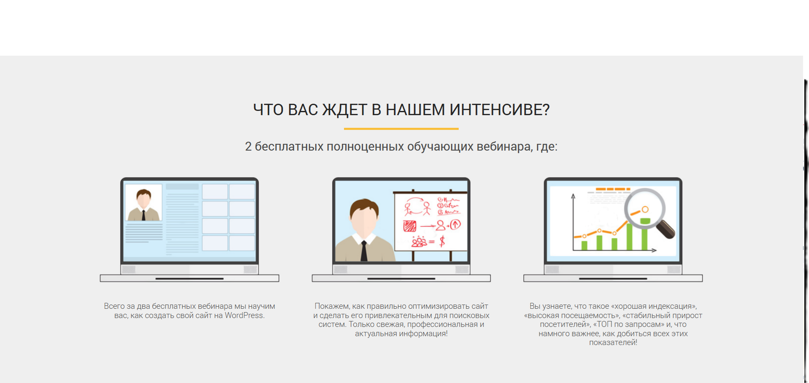
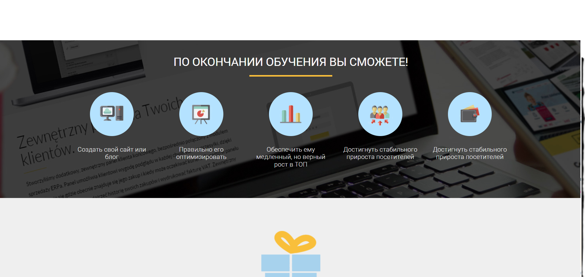
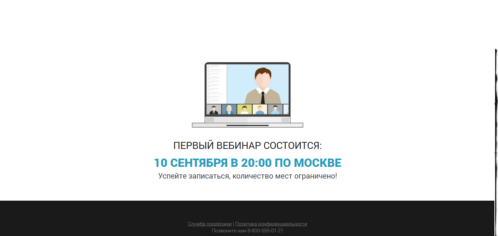

## Структура проекта

**Основные каталоги**

```
.
├── css/
├── fonts/
├── icons/
├── img/
├── index.html
└── README.md

```

=======







**О проекте**

Сайт рекламы курсов WordPress. Верстка.

**Технологии**

- HTML
- SCSS

**Установка**

```

git clone https://github.com/NikRNN/WordPress.git
cd WordPress

```
